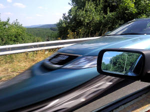
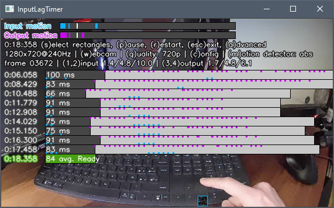

## What is InputLagTimer?

This tool can **measure input lag by analyzing a video** where both the game controller and the game screen can be seen on **a webcam or a video file**.

Here's how it looks in action:


Even though the typical usage is game latency, InputLagTimer can **measure *any* latency** so long as it's captured on video. For example, if you point a camera at both your car key and its door lock, you can measure how fast that remote unlocks your car.


### How does it measure input lag?

You first mark two rectangles in the video you provide:
 - 🟦Input rectangle (blue): where the **input** motion happens. Such as a gamepad stick.
 - 🟪Output rectangle (purple): where the response will be visible. Such as the middle left of your TV screen, where the front wheels can be seen turning in your car simulator.

InputLagTimer will **detect motion** on the input area, and time how long it takes to detect motion on the output area.

Things should work for latencies of up to 700ms; if you need to measure slower events, the limit can be trivially edited in code.


## How to use it:

 1. **Download InputLagTimer** (some [windows binaries are available on github](https://github.com/stenyak/inputLagTimer/releases) if you prefer that)
 1. **Open InputLagTimer**:
    - Plug your webcam then run the program.
    - Or drag-and-drop your video file to the program.
    - Or, from command line, type `InputLagTimer 2` to open the 3rd webcam, or `InputLagTimer file.mp4`  to open a file.
 1. Press `S` then follow screen instructions to **select the 🟦input and 🟪output rectangles**.
 1. Observe the input and output motion bars at the top, and press `1`/`2` and `3`/`4` to **adjust the motion detection thresholds (white indicator)**. Latency timing will start when the input motion passes the threshold, and stop when the output motion does.

Note: a ```.cfg``` file will be created for each video, allowing to reproduce the esame latency analysis


## Tips and gotchas
 - **Use a tripod** to hold the camera. The InputLagTimer is based on motion detection, therefore hand-held footage is doomed to spam false positives.
 - **Disable gamepad vibration** and put the gamepad in a table (unless you want to measure vibration-latency!): in other words,reduce unnecessary motion from both the input and output rectangles.
 - Select the 🟦input and 🟪output rectangles as accurately as possible. E.g. **to measure keyboard key travel time, draw an input rectangle including the entire key height**. If you don't want to include key travel latency, draw the input rectangle as close to the key activation point as possible.
 - If using certain artificial lights, **enable camera's anti-flicker** feature when available (press `C` in InputLagTimer when using a webcam), or choose a recording framerate different than the powerline frequency used in your country (often 50Hz or 60Hz). This removes video flicker, vastly improving motion detection.
 - **Prefer higher recording framerate**, this provides finer-grained latency measurements`
   - Some phones and actioncams can reach hundreds of FPS.
   - Recording equipment may not reach its advertised framerate if it's not bright enough. If in doubt, add more lighting.
 - If your camera cannot reach the requested framerate (e.g. it only manages to capture 120FPS out of 240FPS, due to lack of light), **consider recording directly at the reachable framerate**. This eliminates the useless filler frames your camera was forced to duplicate, making it easier to tune the motion detection thresholds in InputLagTimer.
 - **Prefer global shutter** over [rolling shutter](https://en.wikipedia.org/wiki/Rolling_shutter "rolling shutter") cameras. Rolling shutter can slightly skew latency measurements, as one corner of the image is recorded earlier than the oposite corner.



([source: Axel1963 - CC BY-SA 3.0](https://commons.wikimedia.org/wiki/File:CMOS_rolling_shutter_distortion.jpg))
 - Screens normally refresh pixels from the top earlier than pixels from the bottom (or left before right, etc). The **location of 🟦input/🟪output rectangles in a screen can slightly skew latency** measurements.
 - The pixels on a screen can take longer or shorter to update, depending on:
   - Pixel color. E.g. white-to-black response time might be longer than black-to-white. 
   - Panel type. E.g. OLED will normally by much quicker than LCD panels.
   - Screen configuration. E.g. enabling 'overdrive', enabling 'game mode', etc.
 - Press `A` (Advanced mode) to see more keys and additional information.




## Dependencies

To run the EXE, you don't need anythig else. So move along, nothing to see in this section :)

To run the python code directly, you'll need [opencv](https://opencv.org) [for python](https://github.com/opencv/opencv-python), [numpy](https://numpy.org/), and whichever python interpreter you prefer.

To build the binary (with [compile.py](compile.py)), you'll need [PyInstaller](https://github.com/pyinstaller/pyinstaller).


## Credits and licenses

#### InputLagTimer software:

Copyright 2021 Bruno Gonzalez Campo | [stenyak@stenyak.com](mailto:stenyak@stenyak.com?subject=InputLagTimer) | [@stenyak](https://twitter.com/stenyak)

Distributed under MIT license (see [license.txt](license.txt))

#### InputLagTimer icon:

Copyright 2021 Bruno Gonzalez Campo | [stenyak@stenyak.com](mailto:stenyak@stenyak.com?subject=InputLagTimer) | [@stenyak](https://twitter.com/stenyak)

Distributed under CC BY 3.0 license (see [license_icon.txt](license_icon.txt))

Icon derived from:
 - [Console controller icon by Skoll](https://game-icons.net/1x1/skoll/console-controller.html) (CC BY 3.0)
 - [PC icon by Skoll](https://game-icons.net/1x1/skoll/pc.html) (CC BY 3.0)
